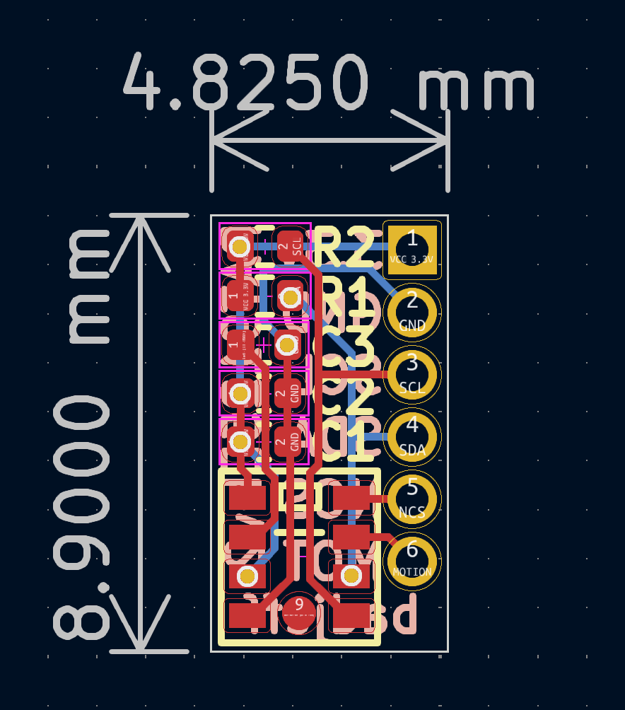

# PAT9125EL PCB

[PixArt PAT9125EL-TKIT / TKMT](https://www.pixart.com/products-detail/72/PAT9125EL-TKIT___TKMT) low power optical tracking sensor breakout board.

- Be operated with 3.3V voltage level ONLY.
- Outlined as narrow as possible for side mount horizontally and perpendicular on low profile keyboards.

## PCB

Online preview avaliable [here](https://kicanvas.org/?github=https%3A%2F%2Fgithub.com%2Fbadjeff%2Fpat9125el-pcb), powered by [KiCanvas](https://github.com/theacodes/kicanvas).

*Figure 2: PCB edgecuts dimension*

*Figure 3: PCB 3D View - 1.6mm FR4*

### BOM

|Designator|Footprint|Quantity|Value|LCSC Part #|
|-|-|-|-|-|
|C1|SMD 0402|1|100nF||
|C2|SMD 0402|1|10uF||
|C3|SMD 0402|1|4.7uF||
|R1, R2|SMD 0402|1|5K||
|U1|PAT9125EL|1|PAT9125EL-TKIT / TKMT||
|J1|1.27mm Pin header|1|1x6||

- SMD 0402 (Imperial) aka 1005 Metric.

### Board Characteristics

- Copper layer count: 2
- Board thickness: 1.6 mm or 1.2 mm or 1.0 mm
- Board overall dimensions: 4.825 x 8.9 mm

### Voltage level config

- 3.3V logic
- VIN: 3.3V

## License

Available under the [CERN-OHL-P v2](/LICENSE) permissive license.
